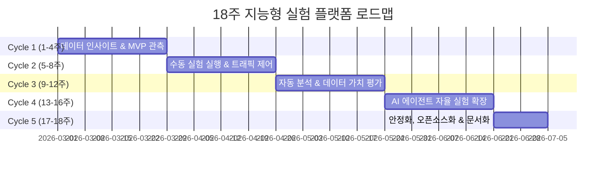

# 🔬 Data Experiment Hub

<div align="center">
  <a href="https://pseudo-lab.com"></a>
  <a href="https://discord.gg/EPurkHVtp2"></a>
  <a href="https://github.com/Pseudo-Lab/experiment-platform-pseudolab/stargazers"></a>
  <a href="https://github.com/Pseudo-Lab/experiment-platform-pseudolab/network/members"></a>
  <a href="https://github.com/Pseudo-Lab/experiment-platform-pseudolab/pulls"></a>
  <a href="https://github.com/Pseudo-Lab/experiment-platform-pseudolab/issues"></a>
  <a href="https://github.com/Pseudo-Lab/experiment-platform-pseudolab/graphs/contributors"></a>
</div>
<br>

> **Data-Driven & AI-Powered Experimentation Platform**
> 가짜연구소의 실제 커뮤니티 데이터를 기반으로, 직관이 아닌 '데이터'를 통한 의사결정으로, '데이터'의 가치를 증명하는 오픈소스 지능형 실험 플랫폼입니다. 데이터 가치 평가의 글로벌 표준을 지향하며, 궁극적으로 AI Agent가 자율적으로 가설을 수립하고 실험을 운영하는 생태계를 만듭니다.

## 🌟 프로젝트 비전 (Project Vision)
_"직관에서 데이터로, 수동에서 자율(AI)로"_

- **데이터 자산 가치 평가의 글로벌 표준화**: 커뮤니티 내 산재된 데이터를 통합하여 실제적인 가치를 측정합니다.
- **자율형 AI 실험 환경**: 사람의 개입을 최소화하고 AI가 직접 가설 수립, A/B 테스트 설계, 결과 해석을 수행합니다.
- **오픈소스 생태계 기여**: 누구나 쉽게 도입하고 확장할 수 있는 오픈소스 기반의 실험 인프라(App/API)를 구축하여 공개합니다.

## 🏛️ 아키텍처 및 기술 스택 (Architecture & Tech Stack)
글로벌 오픈소스 플랫폼으로의 확장을 고려한 모던 클라우드 네이티브 아키텍처입니다.

- **Frontend**: React (TypeScript), Vite, Tailwind CSS (대시보드 및 UI/UX)
- **Backend**: FastAPI (Python), Pydantic (고성능 비동기 API 및 통계 연산 엔진)
- **Data Pipeline**: Cloudflare (D1, R2), Supabase (PostgreSQL, Auth)
- **Infrastructure**: Docker, Kubernetes, ArgoCD (GitOps 기반 무중단 배포)

## 🧑 역동적인 팀 소개 (Dynamic Team)
| 역할 | 이름 | 주요 담당 업무 |
|------|------|----------------|
| **Project Lead<BR>Infra & Full Stack** | 김수현 | 기술 아키텍처 설계, 인프라 구축, 외부 소통 및 풀스택 개발 총괄 |
| **Data Scientist** | 김가경 | 실험 설계 구조화, A/B 테스트 지표 정의, AI Agent 평가 프레임워크 구축 |
| **Data Engineer** | 이동욱 | Cloudflare/Supabase 기반 데이터 파이프라인 구축 및 실시간 로그 적재 |
| **Data Engineer (DW/ETL)** | 장지연 | 다원화된 데이터 통합, Data Warehouse 설계 및 분석 최적화 |
| **Full Stack Developer** | 조성동 | 실험 관리 대시보드 UI 및 백엔드 지표 엔진(Metric Engine) 풀스택 개발 |

## 🚀 프로젝트 로드맵 (Project Roadmap)
우리는 4주 단위의 **Agile & Iterative** 방식으로 플랫폼을 점진적 고도화합니다.



## 🌱 참여 및 기여 안내 (Contributing)
이 프로젝트는 가짜연구소(Pseudo-Lab)의 Value-Driven Initiative로 진행되며, 향후 글로벌 오픈소스 플랫폼으로 성장하는 것을 목표로 합니다.  
플랫폼 고도화, 버그 리포트, 새로운 통계 모델 제안 등 모든 형태의 기여를 환영합니다! (상세한 기여 가이드라인은 추후 공개 예정)

## License 🗞
This project is licensed under the [MIT License](https://opensource.org/licenses/MIT).

## 🖥️ Local Deployment

You can quickly test the application locally utilizing Docker compose.

```bash
# Bring up the Vite DEV Frontend and FastAPI Backend
docker compose -f docker-compose.dev.yml up -d --build
```
- **Frontend App**: [localhost:8081](http://localhost:8081)
- **Backend API**: [localhost:8000/docs](http://localhost:8000/docs)
